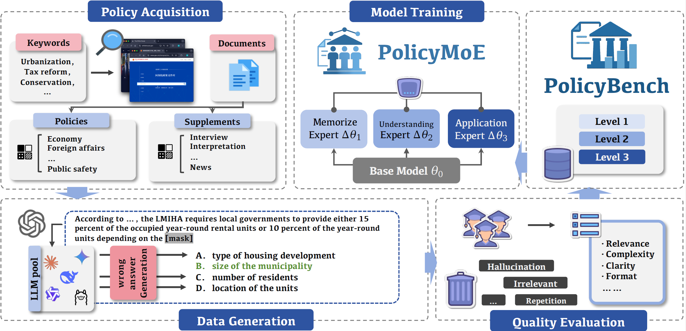
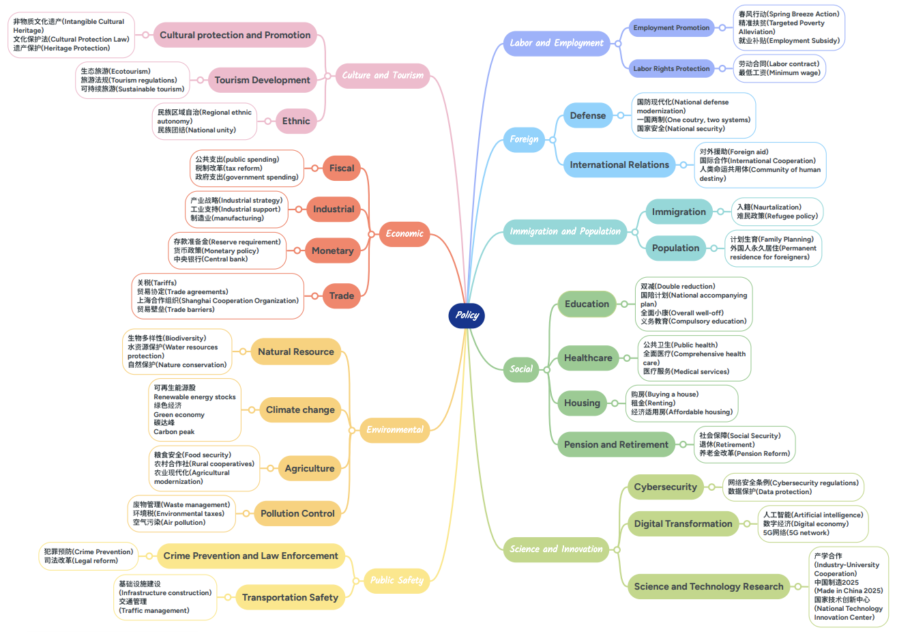

# PolicyLLM


The official repository for the paper **PolicyLLM: Towards Excellent Comprehension of Public Policy for Large Language Models**.

## 🚀 News

- [**Sept. 2025**] We release the benchmark dataset and first version of our paper.

## 🖼️ Overview



## 📊 Description

**PolicyBench** is the first large-scale bilingual benchmark for policy comprehension, containing **21,000 cases from China (11,500)** and **the U.S. (9,500)**, and designed to provide a fine-grained analysis of an LLM's ability to understand public policy. The data collection spans 8 policy categories and 26 sub-categories, with representative keywords used for policy text retrieval. All raw policy documents are provided in `assets/policy_document.zip`



PolicyBench is structured around a three-level hierarchy:

- **Level 1: Memorization:** Assesses the factual recall of policy knowledge, such as dates, terminology, and specific articles.

- **Level 2: Understanding:** Probes the model's ability to grasp conceptual and contextual aspects, including policy intent, stakeholder interests, and institutional logic.

- **Level 3: Application:** Evaluates the model's capacity for practical reasoning and problem-solving in real-world policy scenarios.


## 💡 Data Examples

All questions are stored in JSON files, organized by country and level. The questions has 3 types: multiple-choice, True/False, and open-ended. The following are examples of each type:

- multiple-choice:

  ```
  {
    "question_type": "multiple_choice",
    "question": "According to《U.S.-Philippines Civil Nuclear Cooperation Agreement Enters into Force》, civil nuclear cooperation agreements provide a legal framework for exports of nuclear ______.",
    "answer": "D",
    "explanation": "Civil nuclear cooperation agreements provide a legal framework for exports of nuclear material, equipment, and components.",
    "policy_name": "U.S.-Philippines Civil Nuclear Cooperation Agreement Enters into Force",
    "choice": {
    "A": "technology, expertise, and services",
    "B": "material, technology, and services",
    "C": "material, equipment, and technology",
    "D": "material, equipment, and components"
    },
    "id": 2,
    "classification": "Terminology Recognition"
  },  
  ```

- True/False:
  
  ```
  {
    "policy_name": "United States Strategy on Global Women’s Economic Security",
    "question_type": "true_or_false",
    "question": "The Strategy identifies dismantling systemic barriers to women’s participation as unrelated to addressing gender-based violence.",
    "choice": "true or false",
    "answer": "false",
    "aspect": "Ideas",
    "explanation": "The Strategy explicitly links dismantling systemic barriers to preventing gender-based violence, noting that 'gender-based violence is a global and material systemic risk to economic security' (Section II, Line of Effort 1).",
    "id": 17
  },
  ```

- Open-ended 
  ```
  {
    "policy_name": "Biden-Harris Administration Finalizes Protections for the Pactola Reservoir—Rapid Creek Watershed",
    "question_type": "q&a",
    "question": "How does the Pactola Reservoir protection policy address potential conflicts between mineral development and water security?",
    "answer": "Key Points:\n- Withdraws 20,510 acres from mineral entry/leasing under FLPMA, preventing exploration near critical water sources.\n- Prioritizes municipal water supplies for Rapid City and Ellsworth AFB over extractive industries.\n- Incorporates Tribal and public input to balance cultural, ecological, and economic interests.",
    "id": 1743,
    "classification": "Policy Logic and Value Explanation"
  },
  ```

## 🔍️ Key Findings

Experiments with 11 state-of-the-art LLMs on PolicyBench revealed several key insights:

- **Performance Improves with Complexity:** Models consistently performed better on practical application tasks than on abstract memorization or understanding tasks.

- **Strength in Structured Reasoning:** LLMs excel at tasks with clear logical structures, like numerical calculations and scenario-based decision-making.

- **Cross-Lingual Gap:** Most models performed better on U.S. policy questions than on Chinese ones, highlighting a gap in cross-lingual policy comprehension.


## 🤖 Prompt Template

```
## System

You are a policy expoert. Your task is to answer the following questions.

## Instructions

- If you don't understand the policy mentioned in the question, don't worry; just answer the question based on your knowledge.

Question: {Question}
Options: {Select}

## response format

If it is a single-choice question:
{{
"response":"A or B or C or D",
"Explanation":""
}}
If it is a true or false question:
{{
"response":"True or false",
"Explanation":""
}}

```

## ✍️ Citation

```
@inproceedings{
}
```
