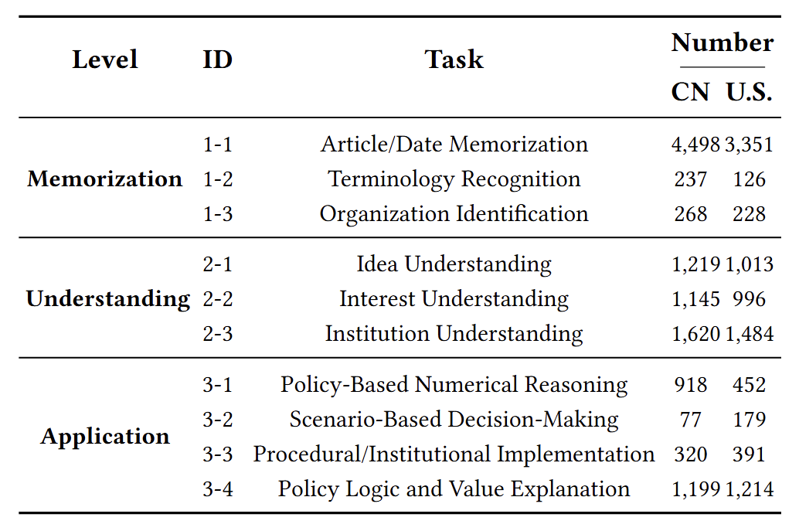

# PolicyLLM


The official repository for the paper **PolicyLLM: Towards Excellent Comprehension of Public Policy for Large Language Models**.

## 🚀 News

- [**Sept. 2025**] We release the benchmark dataset and first version of our paper.

## 🖼️ Overview


## 📊 Description

**PolicyBench** is the first large-scale bilingual benchmark for policy comprehension, containing **21,000 cases from China (11,500)** and **the U.S. (9,500)**, and designed to provide a fine-grained analysis of an LLM's ability to understand public policy. The data collection spans 8 policy categories and 26 sub-categories, with representative keywords used for policy text retrieval.


PolicyBench is structured around a three-level hierarchy:

- **Level 1: Memorization:** Assesses the factual recall of policy knowledge, such as dates, terminology, and specific articles.

- **Level 2: Understanding:** Probes the model's ability to grasp conceptual and contextual aspects, including policy intent, stakeholder interests, and institutional logic.

- **Level 3: Application:** Evaluates the model's capacity for practical reasoning and problem-solving in real-world policy scenarios.




## 🔍️ Key Findings

Experiments with 11 state-of-the-art LLMs on PolicyBench revealed several key insights:

- **Performance Improves with Complexity:** Models consistently performed better on practical application tasks than on abstract memorization or understanding tasks.

- **Strength in Structured Reasoning:** LLMs excel at tasks with clear logical structures, like numerical calculations and scenario-based decision-making.

- **Cross-Lingual Gap:** Most models performed better on U.S. policy questions than on Chinese ones, highlighting a gap in cross-lingual policy comprehension.


## 🤖 Prompt Template

```
## System

You are a policy expoert. Your task is to answer the following questions.

## Instructions

- If you don't understand the policy mentioned in the question, don't worry; just answer the question based on your knowledge.

Question: {Question}
Options: {Select}

## response format

If it is a single-choice question:
{{
"response":"A or B or C or D",
"Explanation":""
}}
If it is a true or false question:
{{
"response":"True or false",
"Explanation":""
}}

```

## ✍️ Citation

```
@inproceedings{
}
```
